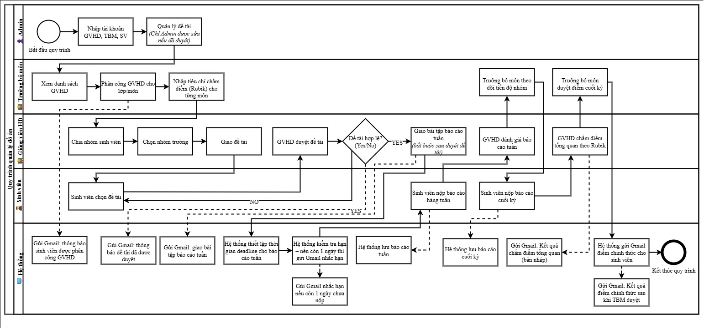
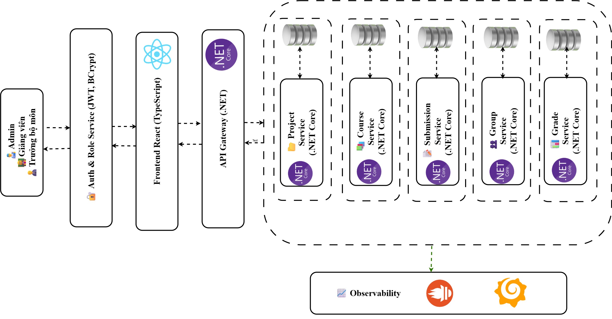

<p align="center">
	
</p>

<h1 align="center">EduProjectSpace</h1>

<p align="center">
	Hệ thống quản lý môn học đồ án, giúp tự động hóa việc theo dõi, nộp bài, và đánh giá các dự án học thuật tại trường đại học. / A course project management system designed to streamline the tracking, submission, and evaluation of academic project-based courses.
</p>

<p align="center">
  <a href="https://github.com/NguyenTriBaoThang/EduProjectSpace/wiki"><strong>📚 Khám phá tài liệu / Explore the docs »</strong></a>
	<br/>
	<br/>
	<a href="https://github.com/NguyenTriBaoThang/EduProjectSpace/issues/new?assignees=&labels=&projects=&template=bug_report.md&title=%F0%9F%90%9B+Bug+Report%3A+">🐛 Báo lỗi / Report Bug</a>
	|
	<a href="https://github.com/NguyenTriBaoThang/EduProjectSpace/issues/new?assignees=&labels=&projects=&template=feature_request.md&title=%F0%9F%9A%80+Feature%3A+">✈️ Yêu cầu tính năng / Request Feature</a>
	|
	<a href="https://github.com/NguyenTriBaoThang/EduProjectSpace/wiki">📚 Xem Wiki / Read Wiki</a>
	|
	<a href="https://github.com/NguyenTriBaoThang/EduProjectSpace/projects?query=is%3Aopen">📋 Lộ trình / Roadmap</a>
</p>


<p align="center">
	
	
	
	
</p>

---

## Giới Thiệu / Introduction

**EduProjectSpace** là hệ thống quản lý môn học đồ án được phát triển để tự động hóa và tối ưu hóa quy trình quản lý học thuật tại các trường đại học, đặc biệt tại **HUTECH**. Hệ thống hỗ trợ **quản trị viên**, **trưởng bộ môn**, **giảng viên**, và **sinh viên** trong việc quản lý thông tin người dùng, nhóm, đề tài, bài nộp, điểm số, lịch bảo vệ, tài nguyên, và thảo luận. Với giao diện thân thiện, tích hợp công nghệ hiện đại như **.NET Core 8.0**, **React với TypeScript**, và **SQL Server**, **EduProjectSpace** đảm bảo hiệu suất cao, bảo mật, và khả năng mở rộng.

**EduProjectSpace** is a course project management system designed to automate and optimize academic management processes at universities, particularly **HUTECH**. It supports **administrators**, **department heads**, **lecturers**, and **students** in managing user information, groups, projects, submissions, grades, defense schedules, resources, and discussions. Built with modern technologies like **.NET Core 8.0**, **React with TypeScript**, and **SQL Server**, **EduProjectSpace** ensures high performance, security, and scalability.

🔗 **Repository**: [https://github.com/NguyenTriBaoThang/EduProjectSpace](https://github.com/NguyenTriBaoThang/EduProjectSpace)  
📚 **Wiki**: [https://github.com/NguyenTriBaoThang/EduProjectSpace/wiki](https://github.com/NguyenTriBaoThang/EduProjectSpace/wiki)


<p align="center">
	<p>Sơ đồ nghiệp vụ: </p>
	
</p>

<p align="center">
	<p>Sơ đồ kiến trúc: </p>
	
</p>


---

## Thông Tin Sinh Viên / Student Information

- **Họ và Tên / Full Name**: Nguyễn Tri Bão Thắng  
- **MSSV / Student ID**: 2180601452  
- **Trường / University**: Đại học Công nghệ TP.HCM (HUTECH)  
- **Email**: [nguyentribaothang@gmail.com](mailto:nguyentribaothang@gmail.com)  
- **GitHub**: [NguyenTriBaoThang](https://github.com/NguyenTriBaoThang)  
- **Giảng viên hướng dẫn / Supervisor**: ThS. Nguyễn Huy Cường  

---

## Tính Năng / Features

**EduProjectSpace** cung cấp các tính năng chính sau:

1. **Quản lý người dùng / User Management**:
   - Tạo, chỉnh sửa, xóa tài khoản (quản trị viên, trưởng bộ môn, giảng viên, sinh viên).
   - Phân quyền chi tiết với các vai trò (Admin, Head, Lecturer, Student).
   - Theo dõi lịch sử hoạt động và trạng thái tài khoản.

2. **Quản lý môn học và kỳ học / Course & Semester Management**:
   - Quản lý thông tin kỳ học, môn học đồ án, tiêu chí chấm điểm, và lịch bảo vệ.
   - Phân công giảng viên hướng dẫn và chấm điểm.

3. **Quản lý nhóm và đề tài / Group & Project Management**:
   - Tạo nhóm, quản lý thành viên, và chỉ định trưởng nhóm.
   - Đề xuất, xét duyệt, và theo dõi trạng thái đề tài.

4. **Quản lý bài nộp / Submission Management**:
   - Nộp bài, theo dõi lịch sử phiên bản, và kiểm tra đạo văn tự động.
   - Giảng viên phản hồi và đánh giá bài nộp.

5. **Quản lý điểm số và phúc khảo / Grade & Review Management**:
   - Nhập điểm số dựa trên tiêu chí chấm điểm, lưu lịch sử chỉnh sửa.
   - Sinh viên tra cứu điểm số và gửi yêu cầu phúc khảo.

6. **Quản lý lịch bảo vệ / Defense Schedule Management**:
   - Lập lịch bảo vệ, quản lý hội đồng chấm điểm, và gửi thông báo.
   - Tra cứu lịch bảo vệ và tài liệu liên quan.

7. **Quản lý nhiệm vụ và tiến độ / Task & Progress Management**:
   - Phân công nhiệm vụ, theo dõi trạng thái, và đánh giá đóng góp cá nhân.
   - Báo cáo tiến độ dự án cho giảng viên và trưởng bộ môn.

8. **Quản lý tài nguyên và thảo luận / Resource & Discussion Management**:
   - Đăng tải tài liệu tham khảo và quản lý tài nguyên nhóm.
   - Diễn đàn thảo luận để trao đổi ý tưởng và câu hỏi.

9. **Thông báo và lịch / Notification & Calendar**:
   - Gửi thông báo qua email hoặc web (cá nhân, nhóm, môn học).
   - Quản lý lịch cá nhân/nhóm cho các sự kiện như họp, hạn nộp bài, bảo vệ.

10. **Bảo mật và bảo trì / Security & Maintenance**:
	- Mã hóa mật khẩu bằng **BCrypt**, xác thực **JWT**, và phân quyền chi tiết.
	- Sao lưu dữ liệu định kỳ và theo dõi hiệu suất hệ thống.

---

## Công Nghệ Sử Dụng / Technologies Used

- **Backend**: 
  - **.NET Core 8.0**: Framework mã nguồn mở để xây dựng API mạnh mẽ và bảo mật.
  - **Entity Framework Core**: ORM ánh xạ dữ liệu với SQL Server.
  - **BCrypt**: Mã hóa mật khẩu người dùng.
  - **JWT Authentication**: Xác thực và phân quyền API.
  - **HostedService**: Tác vụ nền cho sao lưu dữ liệu và thông báo tự động.

- **Frontend**: 
  - **React 18.2 với TypeScript**: Giao diện người dùng động, responsive, và an toàn kiểu dữ liệu.
  - **Fuse.js**: Tìm kiếm mờ linh hoạt cho tên đề tài, người dùng, và tài liệu.
  - **HTML/CSS/JS (Live Server)**: Hỗ trợ giao diện tĩnh đơn giản.

- **Cơ sở dữ liệu / Database**: 
  - **SQL Server 2022**: Lưu trữ dữ liệu quan hệ, tối ưu hiệu suất và toàn vẹn.

- **Công cụ hỗ trợ / Tools**: 
  - Visual Studio, Visual Studio Code, SQL Server Management Studio, Postman.
  - Git, GitHub cho quản lý mã nguồn.

---

## Cấu Trúc Repository / Repository Structure

```
EduProjectSpace/
├── EduProjectSpace.API/          # Backend (.NET Core 8.0)
│   ├── Controllers/              # API controllers
│   ├── Models/                   # Entity models
│   ├── Services/                 # Business logic services
│   ├── Data/                     # Database context (Entity Framework Core)
│   ├── Resources/                # Google credentials and other resources
│   ├── wwwroot/submissions/      # Submission file storage
│   └── appsettings.json          # Configuration file
├── EduProjectSpace.Web/          # Frontend (React or Static HTML/CSS/JS)
│   ├── src/                      # React source code
│   │   ├── components/           # Reusable React components
│   │   ├── pages/                # Page components (Admin, Lecturer, Student)
│   │   ├── assets/               # Images, styles, and static files
│   │   └── App.tsx               # Main React application
│   ├── static/                   # Static HTML/CSS/JS for Live Server
│   │   ├── index.html            # Main static page
│   │   ├── styles.css            # Static styles
│   │   └── script.js             # Static scripts
│   └── .env                      # Environment variables for React
├── docs/                         # Documentation and wiki
├── scripts/                      # SQL scripts for database setup
├── tests/                        # Unit and integration tests
├── .gitignore                    # Git ignore file
├── LICENSE                       # MIT License
└── README.md                     # Project README
```

---

## Hướng Dẫn Cài Đặt và Triển Khai / Setup and Deployment Instructions

Hệ thống **EduProjectSpace** hỗ trợ hai phương án triển khai frontend: (1) sử dụng **Live Server** cho giao diện tĩnh (HTML/CSS/JS), và (2) sử dụng **React** cho giao diện động. Backend sử dụng **.NET Core 8.0** với cấu hình từ file `appsettings.json`.

### 1. Yêu Cầu Hệ Thống / System Requirements
- **Hệ điều hành / OS**: Windows, macOS, hoặc Linux.
- **Công cụ / Tools**:
  - **Node.js** (v18+, chỉ cần cho React): [https://nodejs.org/](https://nodejs.org/).
  - **.NET SDK 8.0**: [https://dotnet.microsoft.com/download/dotnet/8.0](https://dotnet.microsoft.com/download/dotnet/8.0).
  - **SQL Server 2022**: [https://www.microsoft.com/sql-server](https://www.microsoft.com/sql-server).
  - **Visual Studio Code** với extension **Live Server** (cho phương án 1): [https://code.visualstudio.com/](https://code.visualstudio.com/).
  - **Visual Studio**, **Postman**: Để phát triển và kiểm tra API.
- **Kết nối / Connectivity**: Internet ổn định để tải gói và truy cập GitHub.

### 2. Clone Repository / Clone the Repository
```bash
git clone https://github.com/NguyenTriBaoThang/EduProjectSpace.git
cd EduProjectSpace
```

### 3. Cấu Hình Backend / Backend Configuration
1. Di chuyển vào thư mục backend:
   ```bash
   cd EduProjectSpace.API
   ```
2. Cài đặt các gói NuGet:
   ```bash
   dotnet restore
   ```
3. Tạo file `appsettings.json` trong thư mục `EduProjectSpace.API` với nội dung sau, và thay thế các placeholder bằng thông tin thực tế:
   ```json
   {
	 "GoogleCredentialPath": "Resources/credentials.json",
	 "ConnectionStrings": {
	   "DefaultConnection": "Server=[YOUR_SQL_SERVER];Database=EduProject_db;Trusted_Connection=True;TrustServerCertificate=True"
	 },
	 "HuggingFace": {
	   "ApiKey": "[YOUR_HUGGINGFACE_API_KEY]"
	 },
	 "Smtp": {
	   "Host": "smtp.gmail.com",
	   "Port": "587",
	   "Username": "[YOUR_EMAIL]",
	   "Password": "[YOUR_EMAIL_PASSWORD]"
	 },
	 "FileStorage": {
	   "BasePath": "wwwroot/submissions"
	 },
	 "Jwt": {
	   "Key": "[YOUR_JWT_SECRET_KEY]",
	   "Issuer": "EduProjectIssuer",
	   "Audience": "EduProjectAudience"
	 },
	 "Logging": {
	   "LogLevel": {
		 "Default": "Information",
		 "Microsoft.AspNetCore": "Warning"
	   }
	 },
	 "AllowedHosts": "*"
   }
   ```
   - **Lưu ý**:
	 - `[YOUR_SQL_SERVER]`: Tên server SQL (VD: `localhost` hoặc `YOUR_SERVER_NAME`).
	 - `[YOUR_HUGGINGFACE_API_KEY]`: API key từ HuggingFace.
	 - `[YOUR_EMAIL]`, `[YOUR_EMAIL_PASSWORD]`: Tài khoản và mật khẩu email SMTP (VD: Gmail).
	 - `[YOUR_JWT_SECRET_KEY]`: Chuỗi bí mật cho JWT (ít nhất 32 ký tự).
	 - Đảm bảo file `Resources/credentials.json` tồn tại cho Google API (nếu dùng).
	 - Thư mục `wwwroot/submissions` được tạo để lưu trữ file bài nộp.

4. Chạy migrations để tạo cơ sở dữ liệu:
   ```bash
   dotnet ef migrations add InitialCreate
   dotnet ef database update
   ```
5. Chạy backend:
   ```bash
   dotnet run
   ```
   - Backend sẽ chạy tại `http://localhost:5000/api`.

### 4. Cài Đặt Frontend / Frontend Setup

#### Phương Án 1: Sử Dụng Live Server (Giao Diện Tĩnh)
1. Di chuyển vào thư mục frontend:
   ```bash
   cd EduProjectSpace.Web
   ```
2. Đảm bảo thư mục `static/` chứa các file `index.html`, `styles.css`, và `script.js`.
   - Ví dụ cấu hình `script.js` để gọi API:
	 ```javascript
	 const apiUrl = 'http://localhost:5000/api';
	 async function login(username, password) {
	   const response = await fetch(`${apiUrl}/Auth/login`, {
		 method: 'POST',
		 headers: { 'Content-Type': 'application/json' },
		 body: JSON.stringify({ username, password })
	   });
	   const data = await response.json();
	   console.log(data);
	 }
	 ```
3. Mở Visual Studio Code, vào file `static/index.html`, nhấp chuột phải và chọn **Open with Live Server**.
4. Frontend sẽ chạy tại `http://localhost:5500` (cổng mặc định của Live Server).

#### Phương Án 2: Sử Dụng React (Giao Diện Động)
1. Di chuyển vào thư mục frontend:
   ```bash
   cd EduProjectSpace.Web
   ```
2. Cài đặt các gói npm:
   ```bash
   npm install
   ```
3. Tạo file `.env` trong `EduProjectSpace.Web` với nội dung:
   ```env
   REACT_APP_API_URL=http://localhost:5000/api
   ```
4. Chạy frontend:
   ```bash
   npm start
   ```
   - Frontend sẽ chạy tại `http://localhost:3000`.

### 5. Kiểm Tra Hệ Thống / Verify the System
- **API**: Mở Postman và kiểm tra các endpoint tại `http://localhost:5000/api` (xem Swagger tại `/swagger`).
- **Frontend**:
  - **Live Server**: Truy cập `http://localhost:5500` để kiểm tra giao diện tĩnh.
  - **React**: Truy cập `http://localhost:3000` để kiểm tra giao diện động.
- **Cơ sở dữ liệu**: Sử dụng SQL Server Management Studio để kiểm tra bảng `Users`, `Courses`, `Projects`, v.v.
- **Logs**: Kiểm tra nhật ký hệ thống trong bảng `Log` hoặc file log để xác minh hoạt động.

### 6. Triển Khai / Deployment
- **Backend**: 
  - Triển khai trên Azure hoặc AWS với .NET Core hosting.
  - Cập nhật `appsettings.json` với chuỗi kết nối và thông tin thực tế.
- **Frontend**:
  - **Live Server**: Đẩy file tĩnh (`static/`) lên Netlify, Vercel, hoặc GitHub Pages.
  - **React**: Chạy `npm run build` và triển khai thư mục `build/` trên Vercel, Netlify, hoặc AWS S3 với CloudFront.
- **Cơ sở dữ liệu**: Sử dụng Azure SQL Database hoặc AWS RDS cho SQL Server.
- **Cấu hình**: Cập nhật `REACT_APP_API_URL` trong `.env` (React) hoặc `apiUrl` trong `script.js` (Live Server) để trỏ đến backend đã triển khai.

### 7. Dọn Dẹp / Clean Up
- Xóa cơ sở dữ liệu thử nghiệm và tài nguyên đám mây sau khi kiểm tra.
- Kiểm tra chi phí trên Azure/AWS để tránh phát sinh.

---

## Hướng Phát Triển / Future Development

- **Tích hợp AI**: Thêm gợi ý AI để lập kế hoạch, dự đoán rủi ro, và đề xuất tài liệu.
- **Ứng dụng di động**: Phát triển ứng dụng di động đồng bộ với web.
- **Bảo mật nâng cao**: Áp dụng xác thực hai yếu tố (2FA) và mã hóa end-to-end.
- **Tính năng mới**: Tích hợp kiểm tra đạo văn, phân tích dữ liệu học thuật, và đánh giá ngang hàng.
- **Tích hợp LMS**: Kết nối với HUTECH ELearning hoặc các nền tảng họp trực tuyến.

---

## Tài Liệu Tham Khảo / References

1. TS. Cao Tùng Anh (2021), *Giáo trình cơ sở dữ liệu và quản trị cơ sở dữ liệu*.
2. ThS. Văn Như Bích B, ThS. Võ Hoàng Khang (2022), *Phân tích thiết kế hệ thống thông tin*.
3. Nguyễn Đình Ánh, Dương Thành Phết & Nguyễn Huy Cường (2021), *Thực hành lập trình web*, HUTECH.
4. Microsoft, “ASP.NET Core 8.0 Documentation,” [https://learn.microsoft.com/en-us/aspnet/core/](https://learn.microsoft.com/en-us/aspnet/core/).
5. Microsoft Learn, “Entity Framework Core,” [https://learn.microsoft.com/en-us/ef/core/](https://learn.microsoft.com/en-us/ef/core/).
6. Getachew, S., “JWT Authentication in .NET 8,” Medium, [https://medium.com/@solomongetachew112/jwt-authentication-in-net-8-a-complete-guide-for-secure-and-scalable-applications-6281e5e8667c](https://medium.com/@solomongetachew112/jwt-authentication-in-net-8-a-complete-guide-for-secure-and-scalable-applications-6281e5e8667c).

---

## Liên Hệ / Contact

Có thắc mắc hoặc cần hỗ trợ? Liên hệ:  
- **Nguyễn Tri Bão Thắng**: [nguyentribaothang@gmail.com](mailto:nguyentribaothang@gmail.com)  
- **GitHub**: [NguyenTriBaoThang](https://github.com/NguyenTriBaoThang)

🌟 **Cảm ơn bạn đã quan tâm đến EduProjectSpace!** Triển khai hệ thống để trải nghiệm quản lý môn học đồ án hiện đại và hiệu quả! / **Thank you for your interest in EduProjectSpace!** Deploy the system to experience modern and efficient course project management! 🚀

---

## Giấy Phép / License

Dự án được cấp phép theo [MIT License](LICENSE).